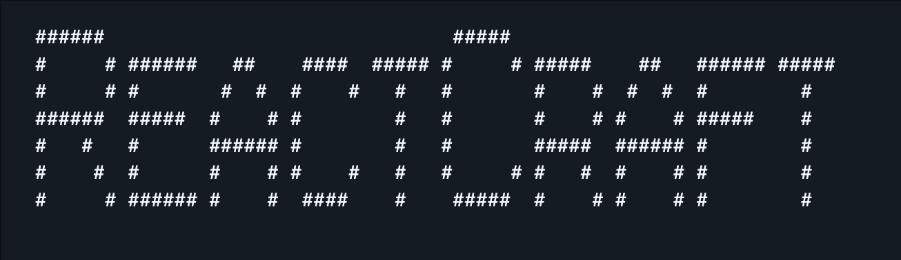
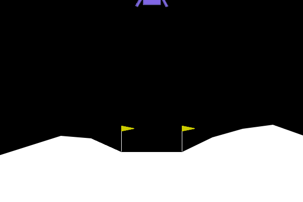
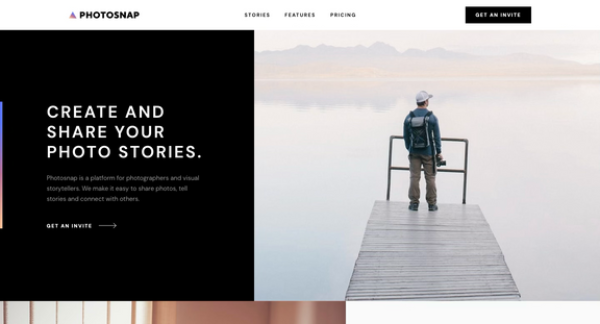
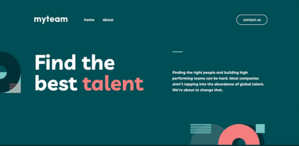
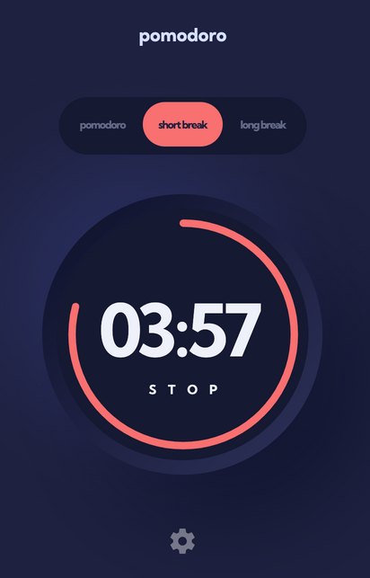
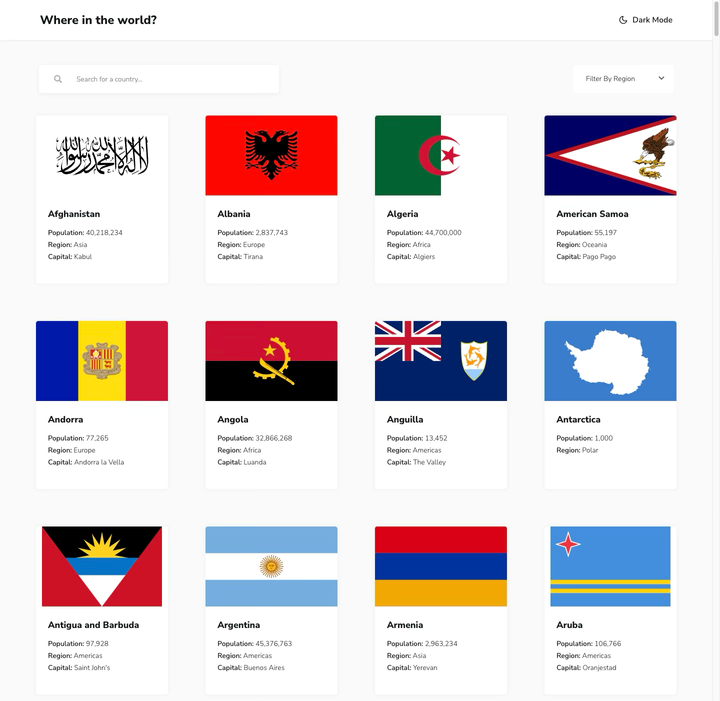
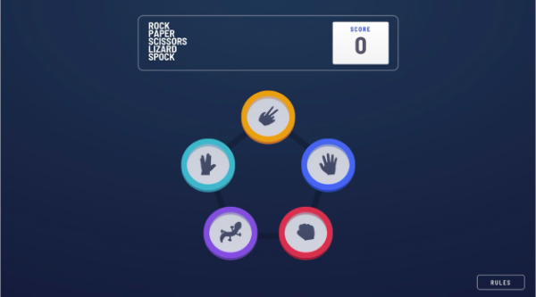

👋🏻 I'm Ilan — a frontend developer with 10+ years of experience building web apps.

I with React, TypeScript, and Tailwind.  
I'm also comfortable in Python and Java, and I've been exploring AI and cybersecurity on the side — like everyone else lately.

#### Projects & Experiments:

<table>
<tr>
    <td width="50%">
      
       ReactCraft
    </td>
  </tr>
  <tr>
  <tr>
    <td width="50%">
      
       DQN Lunar Lander
    </td>
    <td width="50%">
      
       Photosnap Multi-Page Website
    </td>
  </tr>
  <tr>
    <td width="50%">
      
       myteam Multi-Page Website
    </td>
    <td width="50%">
      
       Clock Application
    </td>
  </tr>
  <tr>
    <td width="50%">
      
       Pomodoro Application
    </td>
    <td width="50%">
      
       REST Countries API with Color Theme Switcher
    </td>
  </tr>
  <tr>
    <td width="50%">
      
       Rock, Paper, Scissors
    </td>
  </tr>
</table>
