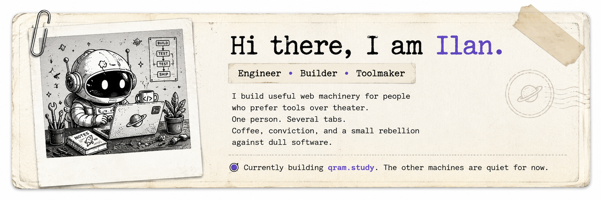
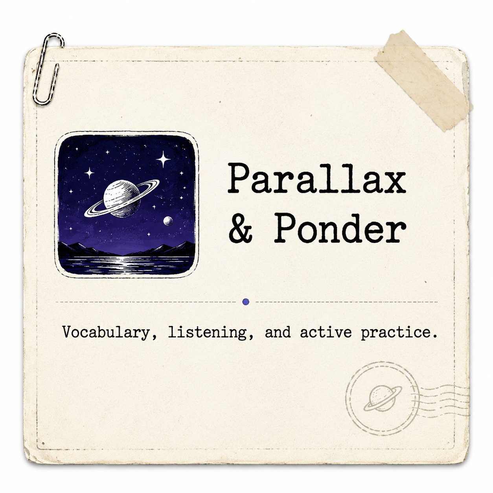
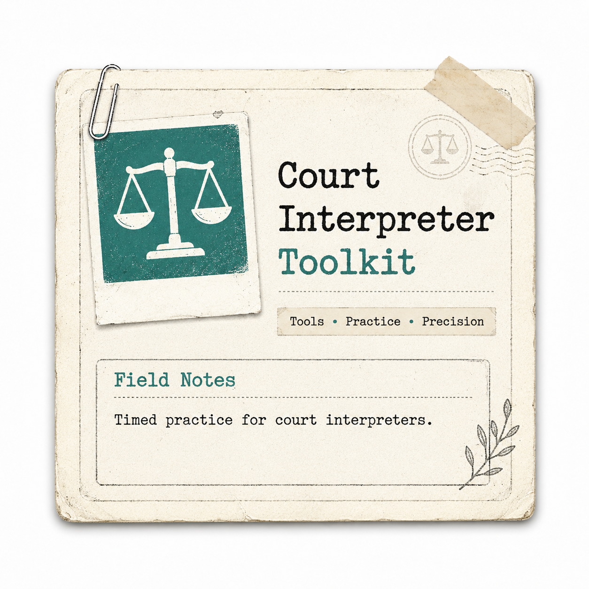
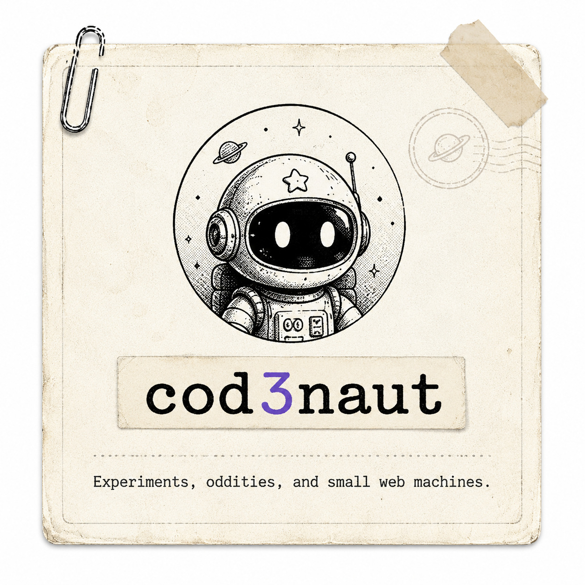
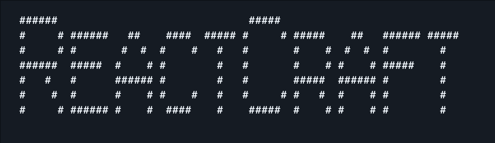
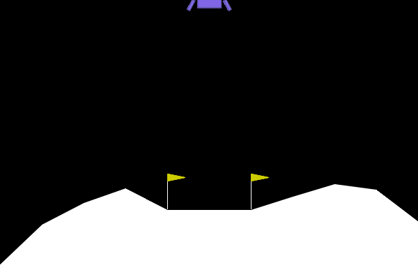
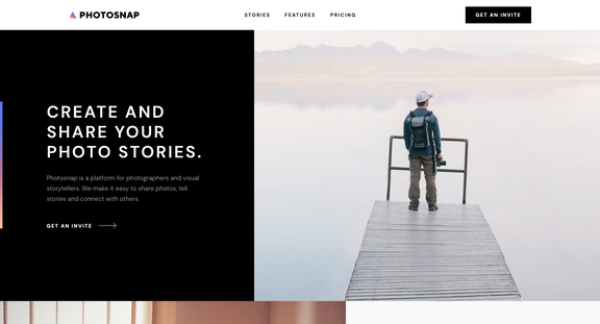
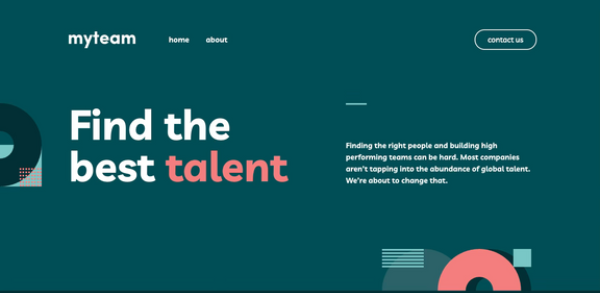
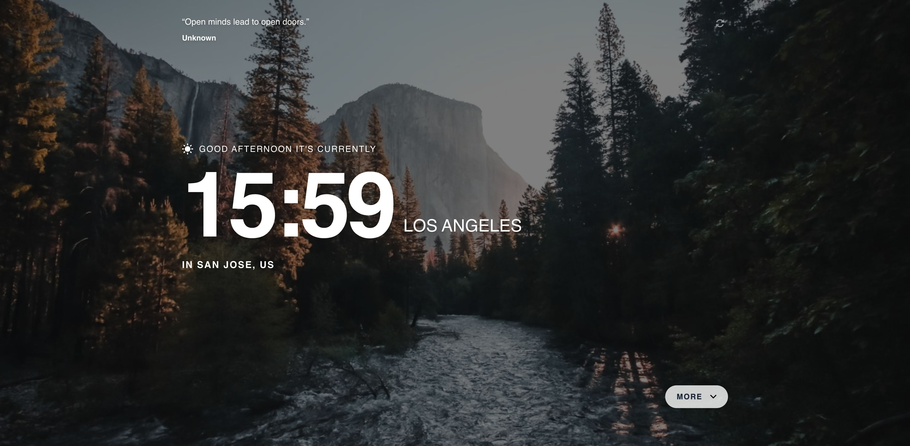
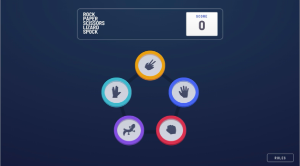

<<<<<<< HEAD

  

 

I build useful web machinery for people who prefer tools over theater.

Frontend developer and design engineer with **20+ years** building web apps, interfaces, and product systems. I work where design, interaction, and implementation stop pretending to be separate departments.

I use **React, TypeScript, Tailwind, Python, and UX architecture**. I use AI as leverage: faster prototypes, sharper research, uglier chores automated before they breed.

> Calm interfaces. Useful features. Ship small. Then simplify.

---

## Current mission

<table>
  <tr>
    <td width="120" valign="top">
      
    </td>
    <td valign="top">
      <h3><a href="https://qram.study">qram.study</a></h3>
      Focused study software for high-volume paired-term learning. Import terms, practice actively, and track what still needs work — without ads, feeds, or mid-session sludge.
        
      <strong>Status:</strong> active. This is the machine currently making noise on the workbench.
    </td>
  </tr>
</table>

---

## Other machines, currently behaving themselves

<table>
  <tr>
    <td width="33%" valign="top">
      
       
      <strong><a href="https://parallaxandponder.online">Parallax &amp; Ponder</a></strong>
       
      A vocabulary app built around short lessons, deeper listening, and active practice.
    </td>
    <td width="33%" valign="top">
      
       
      <strong><a href="https://court-interpreter-toolkit.cod3naut.com/">Court Interpreter Toolkit</a></strong>
       
      A browser-based practice toolkit for court interpreters: timed sessions, task lists, notes, and calendar tracking.
       
      <a href="https://chromewebstore.google.com/detail/court-interpreter-toolkit/ghbnejickfddbmfjkgofklghbmaambhb">Chrome extension</a>
    </td>
    <td width="33%" valign="top">
      
       
      <strong><a href="https://cod3naut.com">cod3naut</a></strong>
       
      My public workshop for experiments, odd little utilities, and small web machines.
    </td>
  </tr>
</table>

---

## Field notes

<table>
  <tr>
    <td width="140" valign="top">
      
    </td>
    <td valign="top">
      <ul>
        <li><strong>20+ years</strong> building for the web.</li>
        <li>Product-minded frontend with a design-engineering bent.</li>
        <li>Calm interfaces over innovation theater.</li>
        <li>Fast enough to ship, stubborn enough to polish.</li>
        <li>Coffee, curiosity, and a healthy suspicion of dull software.</li>
      </ul>
    </td>
  </tr>
</table>

---

## Toolbox

`TypeScript` · `React` · `Tailwind` · `Python` · `Node` · `UX architecture` · `automation` · `AI-assisted product building`

---

## Elsewhere

- [qram.study](https://qram.study)
- [Parallax & Ponder](https://parallaxandponder.online)
- [Court Interpreter Toolkit](https://court-interpreter-toolkit.cod3naut.com/)
- [Court Interpreter Toolkit — Chrome extension](https://chromewebstore.google.com/detail/court-interpreter-toolkit/ghbnejickfddbmfjkgofklghbmaambhb)
- [cod3naut](https://cod3naut.com)

---

One person. Several tabs. A small rebellion against dull software.
=======

👋🏻 I'm Ilan — a frontend developer with 10+ years of experience building web apps.

I with React, TypeScript, and Tailwind.  
I'm also comfortable in Python and Java, and I've been exploring AI and cybersecurity on the side — like everyone else lately.

#### Projects & Experiments:

<table>
<tr>
    <td width="50%">
      
       ReactCraft
    </td>
  </tr>
  <tr>
  <tr>
    <td width="50%">
      
       DQN Lunar Lander
    </td>
    <td width="50%">
      
       Photosnap Multi-Page Website
    </td>
  </tr>
  <tr>
    <td width="50%">
      
       myteam Multi-Page Website
    </td>
    <td width="50%">
      
       Clock Application
    </td>
  </tr>
  <tr>
    <td width="50%">
      
       Pomodoro Application
    </td>
    <td width="50%">
      
       Rock, Paper, Scissors
    </td>
  </tr>
</table>
>>>>>>> 4dc1137758b4192ce01326638d37f3eb6d14fb52
