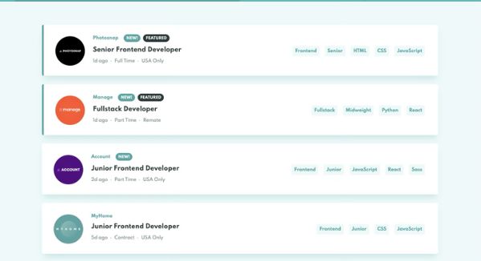

👋🏻 I’m Ilan – I explore AI, cybersecurity, and Python by building strange experiments and practical tools. Lately I’ve been working with reinforcement learning, penetration testing, and the occasional dive into Java or TypeScript when curiosity strikes.

#### Projects & Experiments:

<table>
  <tr>
    <td width="50%">
      
       DQN Lunar Lander
    </td>
    <td width="50%">
      
       Photosnap Multi-Page Website
    </td>
  </tr>
  <tr>
    <td width="50%">
      
       myteam Multi-Page Website
    </td>
    <td width="50%">
      
       Clock Application
    </td>
  </tr>
  <tr>
    <td width="50%">
      
       Pomodoro Application
    </td>
    <td width="50%">
      
       REST Countries API with Color Theme Switcher
    </td>
  </tr>
  <tr>
    <td width="50%">
      
       Job Listings with Filtering
    </td>
  </tr>
</table>
